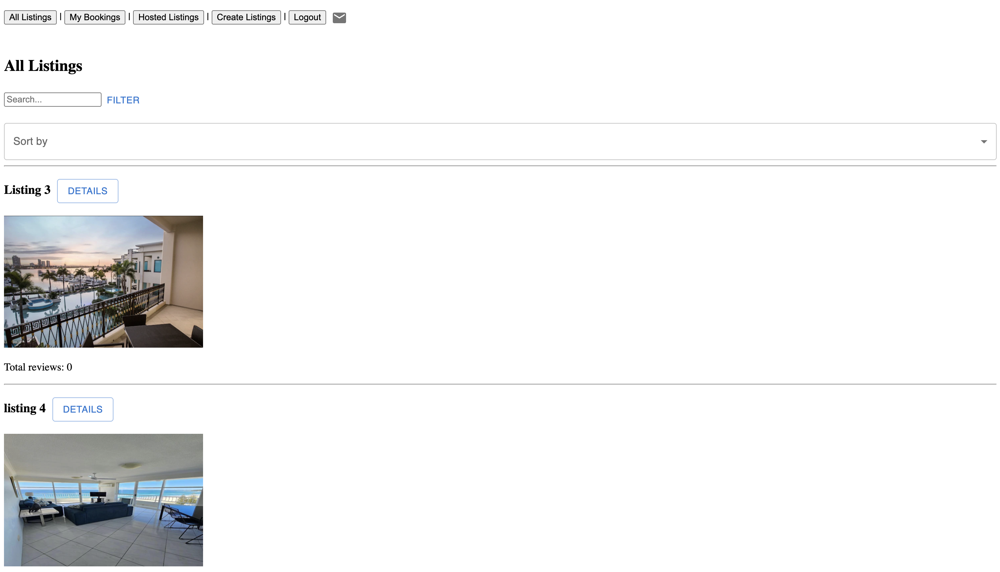
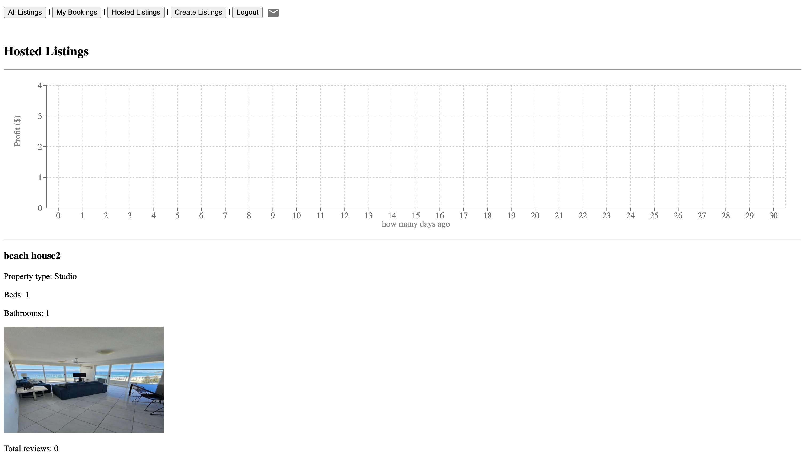
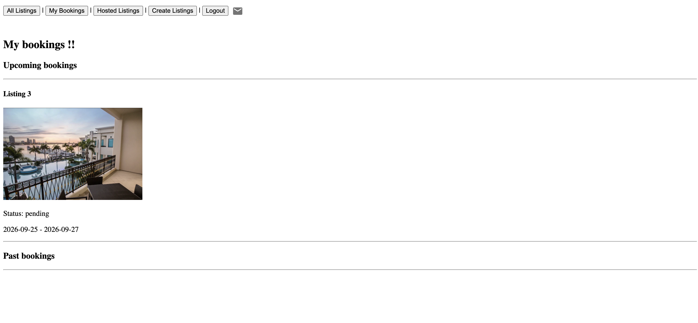

# Airbrb

A React-based accommodation booking platform developed as a university
frontend project.

## Tech Stack

- React
- JavaScript
- Vite
- Cypress

## Features

- User registration and login
- Property listings and search
- Listing creation and editing
- Booking management
- Reviews and ratings
- Notifications

## My Contribution

Developed the frontend using React, implementing multiple application
views, client-side routing, responsive UI components, booking flows,
notifications, and API integration.

## Running Locally

```bash
npm install
npm run dev

## Screenshots

### Listings


### Hosted Listings


### Create Booking


### Bookings
